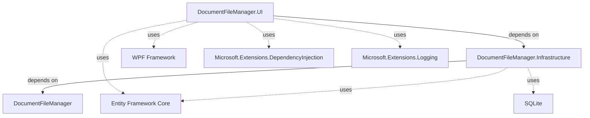

# DocumentFileManager アーキテクチャ・クラス構成

最終更新日: 2025-10-08

## 目次

1. [プロジェクト構成](#1-プロジェクト構成)
2. [レイヤーアーキテクチャ](#2-レイヤーアーキテクチャ)
3. [DocumentFileManager（Entities層）](#3-documentfilemanagerentities層)
4. [DocumentFileManager.Infrastructure（データアクセス層）](#4-documentfilemanagerinfrastructureデータアクセス層)
5. [DocumentFileManager.UI（プレゼンテーション層）](#5-documentfilemanageruiプレゼンテーション層)
6. [データフロー](#6-データフロー)
7. [依存関係図](#7-依存関係図)

---

## 1. プロジェクト構成

```
DocumentFileManager/
├── src/
│   ├── DocumentFileManager/              # Entities層（ドメインモデル）
│   ├── DocumentFileManager.Infrastructure/  # データアクセス層
│   └── DocumentFileManager.UI/           # プレゼンテーション層（WPF）
├── data/
│   └── checklist.json                    # チェックリスト定義
├── docs/                                 # ドキュメント
└── documentmanager.db                    # SQLiteデータベース
```

### プロジェクト依存関係

```
DocumentFileManager.UI
    ↓ depends on
DocumentFileManager.Infrastructure
    ↓ depends on
DocumentFileManager (Entities)
```

---

## 2. レイヤーアーキテクチャ

### 2.1 クリーンアーキテクチャの適用

本プロジェクトは、クリーンアーキテクチャの原則に基づいて設計されています。

```
┌────────────────────────────────────────────┐
│  Presentation Layer (UI)                   │
│  - WPF Windows                             │
│  - ViewModels                              │
│  - UI Helpers                              │
└────────────────┬───────────────────────────┘
                 │ depends on
┌────────────────▼───────────────────────────┐
│  Infrastructure Layer                      │
│  - Repositories                            │
│  - DbContext (EF Core)                     │
│  - Data Services                           │
└────────────────┬───────────────────────────┘
                 │ depends on
┌────────────────▼───────────────────────────┐
│  Domain Layer (Entities)                   │
│  - Entities                                │
│  - Value Objects                           │
│  - Domain Logic                            │
└────────────────────────────────────────────┘
```

### 2.2 各層の責務

| 層 | プロジェクト名 | 責務 |
|----|--------------|------|
| Domain | DocumentFileManager | エンティティ、値オブジェクト、ドメインロジック |
| Infrastructure | DocumentFileManager.Infrastructure | データアクセス、外部サービス連携 |
| Presentation | DocumentFileManager.UI | UI、ユーザー操作、画面表示 |

---

## 3. DocumentFileManager（Entities層）

### 3.1 ディレクトリ構成

```
DocumentFileManager/
├── Entities/
│   ├── Document.cs             # 資料エンティティ
│   ├── CheckItem.cs            # チェック項目エンティティ
│   └── CheckItemDocument.cs    # 資料-チェック項目紐づけ
└── ValueObjects/
    └── ItemStatus.cs           # チェック状態（値オブジェクト）
```

### 3.2 エンティティ詳細

#### 3.2.1 Document（資料）

**ファイル**: `Entities/Document.cs`

```csharp
public class Document
{
    public int Id { get; set; }
    public string FileName { get; set; } = string.Empty;
    public string RelativePath { get; set; } = string.Empty;
    public string FileType { get; set; } = string.Empty;
    public DateTime AddedAt { get; set; }

    // Navigation Property
    public ICollection<CheckItemDocument> CheckItemDocuments { get; set; }
}
```

**責務**:
- 資料ファイルのメタデータ管理
- チェック項目との多対多リレーション

#### 3.2.2 CheckItem（チェック項目）

**ファイル**: `Entities/CheckItem.cs`

```csharp
public class CheckItem
{
    public int Id { get; set; }
    public string Label { get; set; } = string.Empty;
    public string Path { get; set; } = string.Empty;
    public bool IsItem { get; set; }
    public int? ParentId { get; set; }
    public ItemStatus Status { get; set; }

    // Navigation Properties
    public CheckItem? Parent { get; set; }
    public ICollection<CheckItem> Children { get; set; }
    public ICollection<CheckItemDocument> CheckItemDocuments { get; set; }
}
```

**責務**:
- チェック項目・分類の階層構造管理
- Path: 階層パス（例: "大分類/中分類/小分類/項目"）
- IsItem: チェック項目か分類かの判定

#### 3.2.3 CheckItemDocument（紐づけ）

**ファイル**: `Entities/CheckItemDocument.cs`

```csharp
public class CheckItemDocument
{
    public int Id { get; set; }
    public int DocumentId { get; set; }
    public int CheckItemId { get; set; }
    public DateTime LinkedAt { get; set; }

    // Navigation Properties
    public Document Document { get; set; } = null!;
    public CheckItem CheckItem { get; set; } = null!;
}
```

**責務**:
- 資料とチェック項目の多対多関係を管理
- 紐づけ日時の記録

#### 3.2.4 ItemStatus（値オブジェクト）

**ファイル**: `ValueObjects/ItemStatus.cs`

```csharp
public enum ItemStatus
{
    Unchecked = 0,    // 未チェック
    InProgress = 1,   // 確認中
    Completed = 2     // 完了
}
```

**責務**: チェック項目の状態を型安全に表現

---

## 4. DocumentFileManager.Infrastructure（データアクセス層）

### 4.1 ディレクトリ構成

```
DocumentFileManager.Infrastructure/
├── Data/
│   ├── DocumentManagerContext.cs       # DbContext
│   ├── DocumentManagerContextFactory.cs  # デザインタイム用Factory
│   └── DataSeeder.cs                   # 初期データ投入
├── Migrations/
│   ├── 20251007003940_InitialCreate.cs
│   └── DocumentManagerContextModelSnapshot.cs
├── Models/
│   └── CheckItemDefinition.cs          # JSON定義モデル
├── Repositories/
│   ├── IDocumentRepository.cs
│   ├── DocumentRepository.cs
│   ├── ICheckItemRepository.cs
│   ├── CheckItemRepository.cs
│   ├── ICheckItemDocumentRepository.cs
│   └── CheckItemDocumentRepository.cs
└── Services/
    └── ChecklistLoader.cs              # JSON → DB同期
```

### 4.2 主要クラス詳細

#### 4.2.1 DocumentManagerContext（DbContext）

**ファイル**: `Data/DocumentManagerContext.cs`

```csharp
public class DocumentManagerContext : DbContext
{
    public DbSet<Document> Documents { get; set; }
    public DbSet<CheckItem> CheckItems { get; set; }
    public DbSet<CheckItemDocument> CheckItemDocuments { get; set; }

    protected override void OnModelCreating(ModelBuilder modelBuilder)
    {
        // エンティティ設定
        // インデックス設定
        // リレーション設定
    }
}
```

**責務**:
- Entity Framework Coreのコンテキスト
- エンティティ設定、マッピング定義
- SQLite接続管理

#### 4.2.2 Repositories（リポジトリパターン）

**パターン構成**:
```
IRepository<T>
    ├── IDocumentRepository
    ├── ICheckItemRepository
    └── ICheckItemDocumentRepository
```

**主要メソッド（共通）**:

```csharp
Task<T?> GetByIdAsync(int id);
Task<List<T>> GetAllAsync();
Task AddAsync(T entity);
Task UpdateAsync(T entity);
Task DeleteAsync(int id);
Task<int> SaveChangesAsync();
```

**DocumentRepository 固有メソッド**:

```csharp
Task<Document?> GetByRelativePathAsync(string relativePath);
```

**CheckItemRepository 固有メソッド**:

```csharp
Task<List<CheckItem>> GetRootItemsAsync();
Task<List<CheckItem>> GetByParentIdAsync(int? parentId);
```

**CheckItemDocumentRepository 固有メソッド**:

```csharp
Task<List<CheckItemDocument>> GetByCheckItemIdAsync(int checkItemId);
Task<List<CheckItemDocument>> GetByDocumentIdAsync(int documentId);
Task<CheckItemDocument?> GetByDocumentAndCheckItemAsync(int documentId, int checkItemId);
Task DeleteLinkAsync(int checkItemId, int documentId);
```

**責務**:
- データアクセスロジックのカプセル化
- ビジネスロジックとデータアクセスの分離
- テスタビリティの向上

#### 4.2.3 ChecklistLoader（データ同期サービス）

**ファイル**: `Services/ChecklistLoader.cs`

```csharp
public class ChecklistLoader
{
    public async Task LoadChecklistAsync(string jsonPath);
    private async Task LoadCategoryAsync(
        CheckItemDefinition.Category category,
        int? parentId,
        string parentPath);
}
```

**処理フロー**:

```
1. JSONファイル読み込み (checklist.json)
   ↓
2. 既存CheckItemをすべて削除
   ↓
3. カテゴリを再帰的に処理
   ├─ 大分類作成
   ├─ 中分類作成
   ├─ 小分類作成
   └─ チェック項目作成
   ↓
4. データベースに保存
```

**責務**:
- JSON定義からデータベースへの同期
- 階層構造の自動構築
- Path生成とParent-Child関係の管理

#### 4.2.4 CheckItemDefinition（JSON定義モデル）

**ファイル**: `Models/CheckItemDefinition.cs`

```csharp
public class CheckItemDefinition
{
    public List<Category> Categories { get; set; }

    public class Category
    {
        public string Label { get; set; }
        public List<Category>? Children { get; set; }
        public List<string>? Items { get; set; }
    }
}
```

**責務**:
- JSON構造の型定義
- `System.Text.Json` によるデシリアライズ

---

## 5. DocumentFileManager.UI（プレゼンテーション層）

### 5.1 ディレクトリ構成

```
DocumentFileManager.UI/
├── Configuration/
│   ├── UISettings.cs               # UI設定クラス
│   └── PathSettings.cs             # パス設定クラス
├── Helpers/
│   └── CheckItemUIBuilder.cs       # チェック項目UI構築
├── ViewModels/
│   └── CheckItemViewModel.cs       # チェック項目ViewModel
├── MainWindow.xaml
├── MainWindow.xaml.cs              # メインウィンドウ
├── ChecklistWindow.xaml
├── ChecklistWindow.xaml.cs         # チェックリストウィンドウ
├── SettingsWindow.xaml
├── SettingsWindow.xaml.cs          # 設定ウィンドウ
├── App.xaml
└── App.xaml.cs                     # アプリケーションエントリポイント
```

### 5.2 主要クラス詳細

#### 5.2.1 App（エントリポイント）

**ファイル**: `App.xaml.cs`

```csharp
public partial class App : Application
{
    private ServiceProvider? _serviceProvider;

    protected override void OnStartup(StartupEventArgs e)
    {
        // DIコンテナ構築
        var services = new ServiceCollection();
        ConfigureServices(services);
        _serviceProvider = services.BuildServiceProvider();

        // JSON → DB同期
        var checklistLoader = _serviceProvider.GetRequiredService<ChecklistLoader>();
        await checklistLoader.LoadChecklistAsync(checklistPath);

        // MainWindow起動
        var mainWindow = _serviceProvider.GetRequiredService<MainWindow>();
        mainWindow.Show();
    }

    private void ConfigureServices(IServiceCollection services)
    {
        // DbContext登録
        // Repository登録
        // Window登録
        // Helper登録
        // 設定登録
    }
}
```

**責務**:
- アプリケーション起動
- DIコンテナのセットアップ
- 初期データ同期

#### 5.2.2 MainWindow（メインウィンドウ）

**ファイル**: `MainWindow.xaml.cs`

**DI依存**:
```csharp
public MainWindow(
    IDocumentRepository documentRepository,
    ICheckItemRepository checkItemRepository,
    CheckItemUIBuilder checkItemUIBuilder,
    UISettings uiSettings,
    PathSettings pathSettings,
    IServiceProvider serviceProvider,
    ILogger<MainWindow> logger)
```

**主要メソッド**:

| メソッド | 責務 |
|---------|------|
| `LoadDocumentsButton_Click` | 資料リストの読み込み |
| `LoadCheckItemsButton_Click` | チェック項目の読み込み（全体表示） |
| `AddDocumentButton_Click` | 資料追加ダイアログ表示 |
| `RegisterDocumentAsync` | 資料をDBに登録 |
| `RefreshDocumentListAsync` | 資料リストを再読み込み |
| `DocumentsListView_DragEnter` | D&D受け入れ処理 |
| `DocumentsListView_Drop` | D&Dドロップ処理 |
| `DocumentsListView_MouseDoubleClick` | 資料ダブルクリック処理 |
| `OpenChecklistWindow` | チェックリストウィンドウ起動 |
| `GetProjectRoot` | プロジェクトルートパス取得 |
| `GetRelativePath` | 相対パス変換 |

**責務**:
- 資料管理UI
- チェック項目全体表示
- チェックリストウィンドウの起動と管理

#### 5.2.3 ChecklistWindow（チェックリストウィンドウ）

**ファイル**: `ChecklistWindow.xaml.cs`

**Win32 API使用**:
```csharp
[DllImport("user32.dll")]
private const int WM_WINDOWPOSCHANGING = 0x0046;
private const int SWP_NOMOVE = 0x0002;

[StructLayout(LayoutKind.Sequential)]
private struct WINDOWPOS { /* ... */ }
```

**DI依存**:
```csharp
public ChecklistWindow(
    Document document,
    CheckItemUIBuilder checkItemUIBuilder,
    ILogger<ChecklistWindow> logger)
```

**主要メソッド**:

| メソッド | 責務 |
|---------|------|
| `ChecklistWindow_SourceInitialized` | Win32フック設定 |
| `WndProc` | ウィンドウメッセージ処理 |
| `InitializeWindowSize` | ウィンドウサイズ・位置初期化 |
| `ChecklistWindow_Loaded` | チェック項目読み込み |
| `ChecklistWindow_SizeChanged` | サイズ変更時の高さ固定 |
| `DockLeftButton_Click` | 左端配置 |
| `DockRightButton_Click` | 右端配置 |
| `TopmostCheckBox_Checked/Unchecked` | 常に手前表示ON/OFF |

**責務**:
- 資料別チェックリスト表示
- ウィンドウ位置・サイズの固定
- Win32 APIによる移動ブロック

#### 5.2.4 CheckItemUIBuilder（UI構築ヘルパー）

**ファイル**: `Helpers/CheckItemUIBuilder.cs`

**DI依存**:
```csharp
public CheckItemUIBuilder(
    ICheckItemRepository repository,
    ICheckItemDocumentRepository checkItemDocumentRepository,
    UISettings settings,
    ILogger<CheckItemUIBuilder> logger)
```

**主要メソッド**:

| メソッド | 責務 |
|---------|------|
| `BuildAsync` | チェック項目UI全体構築 |
| `BuildViewModelHierarchy` | ViewModel階層構築 |
| `CreateGroupBox` | GroupBox/CheckBox作成 |
| `CreateCheckBox` | CheckBox作成 |
| `SaveStatusAsync` | チェック状態保存 |
| `GetBorderBrush` | 階層別色取得 |

**処理フロー**:

```
1. ルート項目取得
   ↓
2. Document紐づけデータ取得（Document指定時）
   ↓
3. ViewModelツリー構築
   ├─ チェック状態復元
   └─ 子要素の再帰的処理
   ↓
4. UI要素生成
   ├─ GroupBox作成（分類用）
   ├─ CheckBox作成（項目用）
   ├─ WrapPanel/StackPanel選択
   └─ イベントハンドラ設定
   ↓
5. Panelに追加
```

**責務**:
- チェック項目の動的UI構築
- ViewModel変換
- チェック状態の保存・復元
- 資料-チェック項目紐づけ管理

#### 5.2.5 CheckItemViewModel（ViewModel）

**ファイル**: `ViewModels/CheckItemViewModel.cs`

```csharp
public class CheckItemViewModel
{
    public CheckItem Entity { get; }
    public string Label => Entity.Label;
    public string Path => Entity.Path;
    public bool IsItem => Entity.IsItem;
    public bool IsCategory => !Entity.IsItem;
    public ItemStatus Status
    {
        get => Entity.Status;
        set => Entity.Status = value;
    }
    public bool IsChecked { get; set; }
    public ObservableCollection<CheckItemViewModel> Children { get; set; }
}
```

**責務**:
- UIバインディング用プロパティ提供
- CheckItemエンティティのラップ
- 階層構造の保持

#### 5.2.6 UISettings / PathSettings（設定クラス）

**ファイル**: `Configuration/UISettings.cs`, `Configuration/PathSettings.cs`

```csharp
public class UISettings
{
    public GroupBoxSettings GroupBox { get; set; }
    public CheckBoxSettings CheckBox { get; set; }
    public ColorSettings Colors { get; set; }
    public LayoutSettings Layout { get; set; }
}

public class PathSettings
{
    public string ChecklistJsonPath { get; set; }
    public int ProjectRootLevelsUp { get; set; }
}
```

**責務**:
- `appsettings.json` との自動バインディング
- UI設定の一元管理

#### 5.2.7 SettingsWindow（設定ウィンドウ）

**ファイル**: `SettingsWindow.xaml.cs`

**DI依存**:
```csharp
public SettingsWindow(
    UISettings uiSettings,
    PathSettings pathSettings,
    ILogger<SettingsWindow> logger)
```

**責務**:
- UI設定の編集
- パス設定の編集
- JSON形式での保存

---

## 6. データフロー

### 6.1 資料登録フロー

```
User: ファイルをドロップ/選択
    ↓
MainWindow.DocumentsListView_Drop
    ↓
MainWindow.RegisterDocumentAsync
    ├─ 相対パス変換（GetRelativePath）
    ├─ 重複チェック（DocumentRepository.GetByRelativePathAsync）
    └─ エンティティ作成 → DocumentRepository.AddAsync
    ↓
DocumentRepository.SaveChangesAsync
    ↓
DbContext → SQLite
```

### 6.2 チェックリスト表示フロー（資料別）

```
User: 資料をダブルクリック
    ↓
MainWindow.DocumentsListView_MouseDoubleClick
    ├─ ファイルを外部アプリで開く
    └─ OpenChecklistWindow(document)
    ↓
ChecklistWindow作成
    ├─ MainWindow.Hide()
    └─ ChecklistWindow.Show()
    ↓
ChecklistWindow.ChecklistWindow_Loaded
    ↓
CheckItemUIBuilder.BuildAsync(panel, document)
    ├─ CheckItemRepository.GetRootItemsAsync()
    ├─ CheckItemDocumentRepository.GetByDocumentIdAsync(documentId)
    ├─ BuildViewModelHierarchy（チェック状態復元）
    └─ CreateGroupBox（UI生成）
    ↓
WPF UI表示
```

### 6.3 チェック状態保存フロー

```
User: CheckBoxをクリック
    ↓
CheckBox.Checked/Unchecked イベント
    ↓
CheckItemUIBuilder.SaveStatusAsync(viewModel)
    ↓
Documentが指定されている場合:
    ├─ CheckItemDocumentRepository.GetByDocumentAndCheckItemAsync
    ├─ チェックON → AddAsync（紐づけ追加）
    └─ チェックOFF → DeleteAsync（紐づけ削除）
    ↓
CheckItemDocumentRepository.SaveChangesAsync
    ↓
DbContext → SQLite (CheckItemDocuments テーブル)
```

### 6.4 JSON → DB同期フロー

```
App起動
    ↓
App.OnStartup
    ↓
ChecklistLoader.LoadChecklistAsync(jsonPath)
    ├─ JSONファイル読み込み
    ├─ CheckItemRepository: 既存データ削除
    └─ LoadCategoryAsync（再帰処理）
        ├─ 大分類作成
        ├─ 中分類作成
        ├─ 小分類作成
        └─ チェック項目作成
    ↓
CheckItemRepository.SaveChangesAsync
    ↓
DbContext → SQLite (CheckItems テーブル)
```

---

## 7. 依存関係図

### 7.1 プロジェクト依存関係



### 7.2 主要クラス依存関係

```
App (UI)
    ├─> ServiceCollection (DI)
    ├─> DocumentManagerContext (Infrastructure)
    ├─> ChecklistLoader (Infrastructure)
    └─> MainWindow (UI)

MainWindow
    ├─> IDocumentRepository (Infrastructure)
    ├─> ICheckItemRepository (Infrastructure)
    ├─> CheckItemUIBuilder (UI)
    └─> ChecklistWindow (UI)

ChecklistWindow
    ├─> Document (Domain)
    └─> CheckItemUIBuilder (UI)

CheckItemUIBuilder
    ├─> ICheckItemRepository (Infrastructure)
    ├─> ICheckItemDocumentRepository (Infrastructure)
    ├─> UISettings (UI)
    └─> CheckItemViewModel (UI)

DocumentRepository (Infrastructure)
    ├─> DocumentManagerContext (Infrastructure)
    └─> Document (Domain)

CheckItemRepository (Infrastructure)
    ├─> DocumentManagerContext (Infrastructure)
    └─> CheckItem (Domain)

CheckItemDocumentRepository (Infrastructure)
    ├─> DocumentManagerContext (Infrastructure)
    └─> CheckItemDocument (Domain)
```

### 7.3 データモデル関係

```
Document (1) ─────< CheckItemDocument >───── (1) CheckItem
                         (多対多)

CheckItem (親) ─────< CheckItem (子)
                    (自己参照・階層構造)
```

---

## 8. 設計パターン

### 8.1 使用パターン

| パターン名 | 適用箇所 | 目的 |
|-----------|---------|------|
| Repository | Infrastructure層 | データアクセスの抽象化 |
| Dependency Injection | 全層 | 疎結合、テスタビリティ向上 |
| MVVM | UI層 | UIとロジックの分離 |
| Factory | DocumentManagerContextFactory | デザインタイム用インスタンス生成 |
| Strategy | CheckItemUIBuilder | UI構築アルゴリズムの切り替え |
| Singleton | ChecklistWindow | 同時に1つのウィンドウのみ表示 |

### 8.2 SOLID原則の適用

| 原則 | 適用例 |
|-----|-------|
| Single Responsibility | 各リポジトリが1つのエンティティのみ担当 |
| Open/Closed | UISettingsで設定を外部化し拡張可能に |
| Liskov Substitution | IRepositoryインターフェースの統一 |
| Interface Segregation | Repository別にインターフェース分離 |
| Dependency Inversion | 全層でDIコンテナを使用、抽象に依存 |

---

## 9. 技術スタック

| 技術 | バージョン | 用途 |
|------|----------|------|
| .NET | 8.0 / 9.0 | 実行環境 |
| WPF | .NET 9.0 | UIフレームワーク |
| Entity Framework Core | 8.x | O/Rマッパー |
| SQLite | 3.x | データベース |
| Microsoft.Extensions.DependencyInjection | 8.x | DIコンテナ |
| Microsoft.Extensions.Logging | 8.x | ログ出力 |
| Microsoft.Extensions.Configuration | 8.x | 設定管理 |
| System.Text.Json | 8.x | JSON処理 |

---

## 10. ファイル一覧

### 10.1 DocumentFileManager

```
Entities/
    ├── Document.cs (146行)
    ├── CheckItem.cs (178行)
    └── CheckItemDocument.cs (98行)
ValueObjects/
    └── ItemStatus.cs (32行)
```

### 10.2 DocumentFileManager.Infrastructure

```
Data/
    ├── DocumentManagerContext.cs (289行)
    ├── DocumentManagerContextFactory.cs (45行)
    └── DataSeeder.cs (67行)
Migrations/
    ├── 20251007003940_InitialCreate.cs (自動生成)
    └── DocumentManagerContextModelSnapshot.cs (自動生成)
Models/
    └── CheckItemDefinition.cs (89行)
Repositories/
    ├── IDocumentRepository.cs (56行)
    ├── DocumentRepository.cs (124行)
    ├── ICheckItemRepository.cs (68行)
    ├── CheckItemRepository.cs (156行)
    ├── ICheckItemDocumentRepository.cs (74行)
    └── CheckItemDocumentRepository.cs (80行)
Services/
    └── ChecklistLoader.cs (234行)
```

### 10.3 DocumentFileManager.UI

```
Configuration/
    ├── UISettings.cs (156行)
    └── PathSettings.cs (45行)
Helpers/
    └── CheckItemUIBuilder.cs (346行)
ViewModels/
    └── CheckItemViewModel.cs (123行)
MainWindow.xaml (267行)
MainWindow.xaml.cs (416行)
ChecklistWindow.xaml (55行)
ChecklistWindow.xaml.cs (232行)
SettingsWindow.xaml (198行)
SettingsWindow.xaml.cs (245行)
App.xaml (23行)
App.xaml.cs (189行)
```

---

## 11. まとめ

### 11.1 アーキテクチャの特徴

1. **クリーンアーキテクチャ**: 層の分離により保守性・テスタビリティを確保
2. **リポジトリパターン**: データアクセスを抽象化し、変更に強い設計
3. **依存性注入**: 全層でDIを採用し、疎結合を実現
4. **設定の外部化**: `appsettings.json` でUI設定を柔軟に変更可能

### 11.2 拡張性

- **新規エンティティ追加**: Domain層にエンティティ追加、Repositoryインターフェース定義、Infrastructure層で実装
- **新規UI追加**: UI層にWindowを追加、DIコンテナに登録
- **データソース変更**: Infrastructure層のみ変更（SQLite → SQL Server等）

### 11.3 保守性

- **単一責任の原則**: 各クラスの責務が明確
- **テスト容易性**: インターフェースによる抽象化でモック作成が容易
- **ログ出力**: 全層でILoggerを使用し、デバッグが容易
