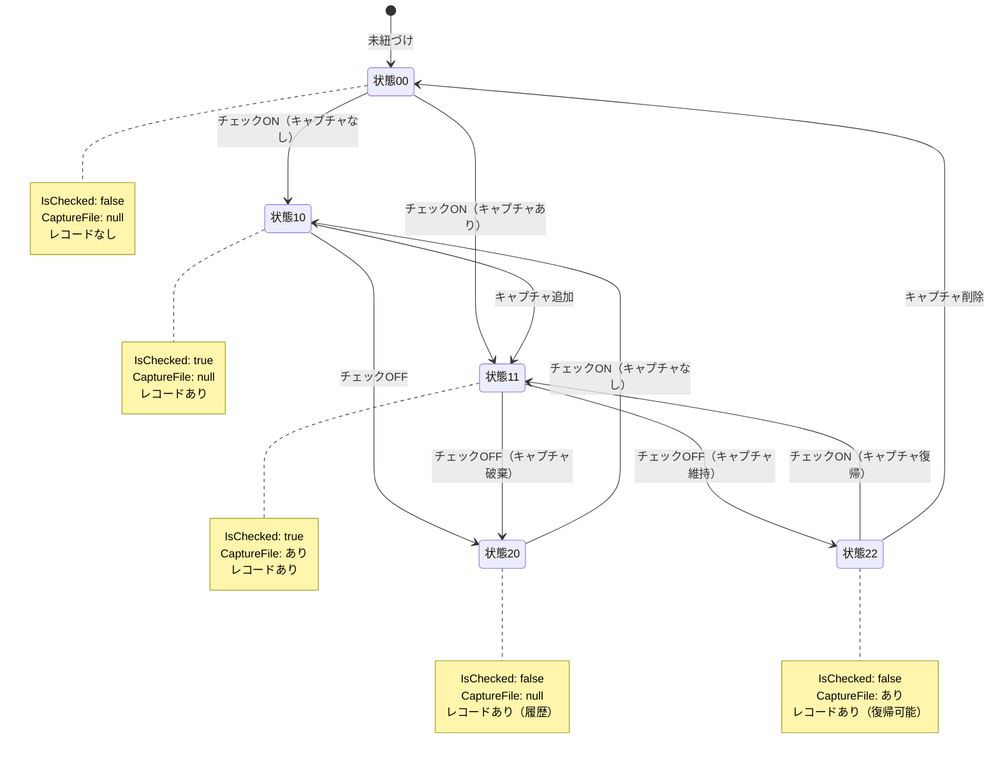

# 実装プラン: CheckItemUIBuilderリファクタリング

## 📋 概要

現在の`CheckItemUIBuilder`クラスは、単一責任原則（SRP）に違反しており、UI構築、イベント処理、DB操作、状態管理という複数の責務が混在しています。これにより、async/awaitとWPFイベント処理の競合が発生し、UIの描画が正しく反映されない問題が生じています。

本リファクタリングでは、責務を明確に分離し、MVVMパターンに準拠した設計に再構成することで、保守性とテスト容易性を向上させ、描画の不整合問題を解決します。

### 現在の問題点

1. **単一責任原則違反**: 1つのクラスが4つの責務を持っている
   - UI構築（CheckBox、Button、GroupBoxの生成）
   - イベント処理（Checked/Uncheckedイベントハンドラ）
   - DB操作（CheckItemDocumentRepositoryへの保存）
   - 状態管理（チェック状態、キャプチャファイルパス）

2. **MVVMパターン不徹底**: ViewModelが存在するのに、INotifyPropertyChangedによるバインディングを使わず、直接UI操作を行っている

3. **async/await競合**: 非同期DB操作中にUIを直接更新するため、描画が正しく反映されない

4. **テスト困難性**: UI生成とビジネスロジックが密結合しており、単体テストが困難

5. **既存クラスの未使用**: `CheckItemTransition`クラスが作成済みだが、未使用のまま放置されている

## 🎯 要件整理

### 機能要件

1. **責務の分離**: UI構築、状態管理、イベント処理、DB操作を別クラスに分離
2. **MVVMパターン準拠**: ViewModelのプロパティ変更をバインディングで自動的にUIに反映
3. **状態遷移管理**: `CheckItemTransition`を活用し、DBコミット前の状態を一時保持
4. **既存機能の維持**: 現在の全機能（チェック、キャプチャ、画像復帰、削除等）を維持
5. **バックワード互換性**: ChecklistWindow、MainWindowからの使用方法は変更しない

### 非機能要件

1. **パフォーマンス**: UI描画の遅延を発生させない（非同期処理の適切な分離）
2. **保守性**: 各クラスの責務を明確にし、変更容易性を高める
3. **テスト容易性**: ビジネスロジックを単体テストできるようにする
4. **拡張性**: 将来的な機能追加に対応しやすい設計

## 🏗️ アーキテクチャ設計

### 全体構成

```
[ChecklistWindow]
      ↓ 使用
[CheckItemUIBuilder] ← UI構築専用
      ↓ 生成
[CheckItemView (DataTemplate)] ← 必須化
      ↓ バインディング
[CheckItemViewModel] ← 状態管理（INotifyPropertyChanged）
      ↓ ICommand実行 (CommunityToolkit.Mvvm使用)
[ChecklistStateManager] ← 状態遷移とDB操作
      ↓ ダイアログ表示
[IDialogService] ← MessageBox抽象化（テスト可能）
      ↓ 一時状態保持
[CheckItemTransition] ← 一時状態保持
      ↓ DB操作
[ICheckItemDocumentRepository]
```

### ファイル配置

```
src/DocumentFileManager.UI/
├── Services/
│   ├── Abstractions/
│   │   └── IDialogService.cs (新規作成)
│   ├── ChecklistStateManager.cs (新規作成)
│   └── WpfDialogService.cs (新規作成)
├── Helpers/
│   └── CheckItemUIBuilder.cs (リファクタリング対象)
├── ViewModels/
│   └── CheckItemViewModel.cs (既存、拡張)
├── Models/
│   └── CheckItemTransition.cs (既存、活用)
├── Controls/
│   └── CheckItemControl.cs (DataTemplateとして必須実装)
└── Windows/
    └── ChecklistWindow.xaml.cs (軽微な修正)

src/DocumentFileManager.UI.Tests/
├── Services/
│   └── ChecklistStateManagerTests.cs (新規作成)
└── ViewModels/
    └── CheckItemViewModelTests.cs (新規作成)
```

### クラス設計

#### 1. IDialogService (新規作成)

**責務**: MessageBoxを抽象化し、テスト可能にする

```csharp
public interface IDialogService
{
    /// <summary>
    /// 確認ダイアログを表示
    /// </summary>
    /// <param name="message">メッセージ</param>
    /// <param name="title">タイトル</param>
    /// <returns>ユーザーの選択結果（はい=true、いいえ=false）</returns>
    Task<bool> ShowConfirmationAsync(string message, string title);

    /// <summary>
    /// 選択ダイアログを表示（はい/いいえ/キャンセル）
    /// </summary>
    /// <param name="message">メッセージ</param>
    /// <param name="title">タイトル</param>
    /// <returns>ユーザーの選択結果（はい=Yes、いいえ=No、キャンセル=Cancel）</returns>
    Task<DialogResult> ShowYesNoCancelAsync(string message, string title);

    /// <summary>
    /// 情報ダイアログを表示
    /// </summary>
    Task ShowInformationAsync(string message, string title);

    /// <summary>
    /// エラーダイアログを表示
    /// </summary>
    Task ShowErrorAsync(string message, string title);
}

public enum DialogResult
{
    Yes,
    No,
    Cancel
}
```

**実装**: WpfDialogService（MessageBox.Showのラッパー）

#### 2. CheckItemUIBuilder (リファクタリング後)

**責務**: UI構築とバインディング設定のみ

- `BuildAsync()`: ViewModel階層からUIツリーを生成
- `CreateGroupBox()`: GroupBoxを生成し、Childrenをバインディング
- `CreateCheckItemView()`: DataTemplateを使用してCheckBoxとButtonを生成し、ViewModelにバインド
- `GetBorderBrush()`: 階層深度に応じた色を取得

**削除する責務**:
- ❌ イベントハンドラ内のDB操作 → ChecklistStateManagerへ移動
- ❌ チェック状態の直接変更 → ViewModelのバインディングで自動化
- ❌ `SaveStatusAsync()` → ChecklistStateManagerへ移動
- ❌ キャプチャファイル確認ダイアログ → IDialogServiceへ移動

#### 3. CheckItemViewModel (既存、拡張)

**責務**: チェック項目の状態管理とUIへの通知

**既存プロパティ**:
- `IsChecked` (INotifyPropertyChanged実装済み)
- `CaptureFilePath` (INotifyPropertyChanged実装済み)
- `HasCapture` (計算プロパティ)

**追加プロパティ**:
- `IsCheckBoxEnabled`: チェックボックスの有効/無効状態（MainWindowでは無効化）
- `CameraButtonVisibility`: カメラボタンの表示/非表示

**追加コマンド（CommunityToolkit.Mvvm使用）**:
- `CheckedChangedCommand`: RelayCommand（チェック状態変更時）
  - async voidの問題を回避するため、try-catchでエラーハンドリング明確化
- `ViewCaptureCommand`: RelayCommand（カメラボタンクリック時）

**追加メソッド**:
- `UpdateCaptureButton()`: キャプチャファイルの存在確認とボタン表示更新

**Dispose対応**:
- IDisposable実装または WeakEventManager使用を検討（メモリリーク防止）

**IsCheckedの初期化ロジック明確化**:
- **MainWindow**: 最新キャプチャがあればチェック表示（読み取り専用、IsCheckBoxEnabled=false）
- **ChecklistWindow**: CheckItemDocumentのIsCheckedから復元（編集可能、IsCheckBoxEnabled=true）
- **Entity.Statusとの関係**: `Status == CheckItemStatus.Done` の場合、IsChecked初期値をtrueにする

#### 4. ChecklistStateManager (新規作成)

**責務**: チェックボックスクリック時の状態遷移ロジックとDB操作

**依存関係**:
- `ICheckItemDocumentRepository`: DB操作
- `IDialogService`: ダイアログ表示（テスト可能）
- `ILogger<ChecklistStateManager>`: ログ出力

**主要メソッド**:

```csharp
/// <summary>
/// チェックON時の処理
/// </summary>
Task<CheckItemTransition> HandleCheckOnAsync(
    CheckItemViewModel viewModel,
    Document document);

/// <summary>
/// チェックOFF時の処理
/// </summary>
Task<CheckItemTransition> HandleCheckOffAsync(
    CheckItemViewModel viewModel,
    Document document);

/// <summary>
/// キャプチャ保存後の処理
/// </summary>
Task CommitCaptureAsync(
    CheckItemViewModel viewModel,
    Document document,
    string captureFilePath);

/// <summary>
/// 既存キャプチャ復帰の確認
/// </summary>
Task<RestoreResult> ConfirmRestoreExistingCaptureAsync(
    CheckItemViewModel viewModel,
    Document document);

/// <summary>
/// 状態をDBにコミット
/// </summary>
Task CommitTransitionAsync(CheckItemTransition transition);

/// <summary>
/// 状態をロールバック
/// </summary>
Task RollbackTransitionAsync(CheckItemTransition transition);
```

**状態遷移の定義**:
- `00` → `10`: 未紐づけ → チェックON（キャプチャなし）
- `00` → `11`: 未紐づけ → チェックON（キャプチャあり）
- `10` → `11`: キャプチャなし → キャプチャあり
- `11` → `20`: チェックON → チェックOFF（キャプチャ破棄）
- `11` → `22`: チェックON → チェックOFF（キャプチャ維持）
- `22` → `11`: チェックOFF → チェックON（キャプチャ復帰）

#### 4. CheckItemTransition (既存、活用)

**責務**: チェック項目の一時状態を管理（DBコミット前）

既存実装を活用し、以下の機能を提供：
- 元の状態の保持（ロールバック用）
- 遷移先状態の保持
- 変更検出（`HasChanges`）
- 新規レコード判定（`RequiresNewRecord`）

#### 5. CheckItemControl (新規作成、必須)

**責務**: CheckBoxとカメラボタンを含むUIコントロール

**実装方針**: DataTemplateとして実装（必須化）

```xml
<!-- ChecklistWindow.xaml または App.xaml のResourcesに配置 -->
<DataTemplate x:Key="CheckItemTemplate">
    <StackPanel Orientation="Horizontal">
        <CheckBox Content="{Binding Label}"
                  IsChecked="{Binding IsChecked, Mode=TwoWay}"
                  IsEnabled="{Binding IsCheckBoxEnabled}"
                  Command="{Binding CheckedChangedCommand}" />
        <Button Content="📷"
                Visibility="{Binding CameraButtonVisibility}"
                Command="{Binding ViewCaptureCommand}" />
    </StackPanel>
</DataTemplate>
```

**メリット**:
- コードビハインドでUI生成コードが不要
- XAMLでデザイン可能
- バインディングが自動適用される

### 設計パターン

1. **MVVM (Model-View-ViewModel)**: UI（View）とロジック（ViewModel）の完全分離
2. **Command Pattern**: ICommandを使用したイベント処理の分離
3. **State Pattern**: CheckItemTransitionによる状態遷移の管理
4. **Dependency Injection**: 各クラスの依存関係をDIコンテナで管理
5. **Repository Pattern**: DB操作を抽象化（既存のICheckItemDocumentRepository）

### 状態遷移図



### データフロー

#### チェックON時のフロー

```
1. [CheckBox] ユーザーがチェック
   ↓ バインディング
2. [CheckItemViewModel] IsChecked = true に変更
   ↓ PropertyChanged イベント発火
3. [CheckItemViewModel] CheckedChangedCommand 実行
   ↓ Command呼び出し
4. [ChecklistStateManager] HandleCheckOnAsync() 実行
   ↓
5. 既存キャプチャ確認（ConfirmRestoreExistingCaptureAsync）
   ├─ あり → MessageBox表示 → ユーザー選択
   │   ├─ 復帰 → CheckItemTransition.RestoreTo11() → DB更新不要
   │   ├─ 破棄 → CheckItemTransition.TransitionTo10() → DB更新（CaptureFile=null）
   │   └─ キャンセル → Rollback() → IsChecked = false に戻す
   └─ なし → CheckItemTransition.TransitionTo10()
   ↓
6. キャプチャ取得確認（MessageBox）
   ├─ はい → キャプチャ処理 → CommitCaptureAsync() → State: 11
   └─ いいえ → State: 10 のまま
   ↓
7. [ChecklistStateManager] CommitTransitionAsync() → DB保存
   ↓
8. [CheckItemViewModel] CaptureFilePath, IsChecked プロパティ更新
   ↓ バインディング
9. [CheckBox, Button] UI自動更新
```

#### チェックOFF時のフロー

```
1. [CheckBox] ユーザーがチェック解除
   ↓ バインディング
2. [CheckItemViewModel] IsChecked = false に変更
   ↓ PropertyChanged イベント発火
3. [CheckItemViewModel] CheckedChangedCommand 実行
   ↓ Command呼び出し
4. [ChecklistStateManager] HandleCheckOffAsync() 実行
   ↓
5. CheckItemTransition.TransitionToOff()
   ├─ CaptureFile あり → State: 22（キャプチャ維持）
   └─ CaptureFile なし → State: 20（履歴のみ）
   ↓
6. [ChecklistStateManager] CommitTransitionAsync() → DB更新（IsChecked=false）
   ↓
7. [CheckItemViewModel] IsChecked = false（既に設定済み）
   ↓ バインディング
8. [CheckBox] チェックOFF状態を維持
9. [Button] Visibility = Collapsed（自動）
```

## ✅ 実装チェックリスト

### Phase 1: IDialogServiceの実装（TDD）

- [ ] CommunityToolkit.Mvvmパッケージをインストール
  ```bash
  dotnet add src/DocumentFileManager.UI package CommunityToolkit.Mvvm
  ```

- [ ] `IDialogService.cs` インターフェース作成（Services/Abstractions/）
  - [ ] `ShowConfirmationAsync(string message, string title)` メソッド定義
  - [ ] `ShowYesNoCancelAsync(string message, string title)` メソッド定義
  - [ ] `ShowInformationAsync(string message, string title)` メソッド定義
  - [ ] `ShowErrorAsync(string message, string title)` メソッド定義
  - [ ] `DialogResult` enum定義（Yes, No, Cancel）

- [ ] `WpfDialogService.cs` 実装クラス作成（Services/）
  - [ ] `ShowConfirmationAsync` 実装（MessageBox.Showのラッパー）
  - [ ] `ShowYesNoCancelAsync` 実装（MessageBoxButton.YesNoCancelのラッパー）
  - [ ] `ShowInformationAsync` 実装（MessageBoxImage.Informationのラッパー）
  - [ ] `ShowErrorAsync` 実装（MessageBoxImage.Errorのラッパー）
  - [ ] Dispatcher対応（UIスレッドで実行保証）

- [ ] `WpfDialogServiceTests.cs` テストクラス作成（モック使用）
  - [ ] `ShowConfirmationAsync_ユーザーがはいを選択_trueを返す`
  - [ ] `ShowYesNoCancelAsync_ユーザーがキャンセルを選択_Cancelを返す`

- [ ] `AppInitializer.cs` にIDialogServiceを登録
  ```csharp
  services.AddSingleton<IDialogService, WpfDialogService>();
  ```

### Phase 2: ChecklistStateManagerの実装（TDD）

- [ ] `ChecklistStateManagerTests.cs` テストクラス作成
  - [ ] `HandleCheckOnAsync_未紐づけ_キャプチャなし_状態10へ遷移`
  - [ ] `HandleCheckOnAsync_既存キャプチャあり_復帰選択_状態11へ遷移`
  - [ ] `HandleCheckOnAsync_既存キャプチャあり_破棄選択_状態10へ遷移`
  - [ ] `HandleCheckOnAsync_既存キャプチャあり_キャンセル_ロールバック`
  - [ ] `HandleCheckOffAsync_キャプチャあり_状態22へ遷移`
  - [ ] `HandleCheckOffAsync_キャプチャなし_状態20へ遷移`
  - [ ] `CommitCaptureAsync_新規キャプチャ保存_状態11へ遷移`
  - [ ] `CommitTransitionAsync_新規レコード作成`
  - [ ] `CommitTransitionAsync_既存レコード更新`
  - [ ] `RollbackTransitionAsync_元の状態に復元`

- [ ] `ChecklistStateManager.cs` 実装
  - [ ] コンストラクタ（ICheckItemDocumentRepository, IDialogService, ILogger依存注入）
  - [ ] `HandleCheckOnAsync` 実装
    - [ ] IDialogService.ShowYesNoCancelAsyncでキャプチャ復帰確認
    - [ ] try-catchでエラーハンドリング明確化
  - [ ] `HandleCheckOffAsync` 実装
    - [ ] try-catchでエラーハンドリング明確化
  - [ ] `ConfirmRestoreExistingCaptureAsync` 実装（IDialogService使用）
  - [ ] `CommitCaptureAsync` 実装
  - [ ] `CommitTransitionAsync` 実装
  - [ ] `RollbackTransitionAsync` 実装

- [ ] `AppInitializer.cs` にChecklistStateManagerを登録
  ```csharp
  services.AddScoped<ChecklistStateManager>();
  ```

### Phase 3: CheckItemViewModelの拡張（TDD）

- [ ] `CheckItemViewModelTests.cs` テストクラス作成
  - [ ] `IsChecked_変更時_PropertyChangedイベント発火`
  - [ ] `CaptureFilePath_変更時_PropertyChangedとHasCaptureイベント発火`
  - [ ] `CameraButtonVisibility_HasCaptureとファイル存在で表示`
  - [ ] `CameraButtonVisibility_HasCapture=falseで非表示`
  - [ ] `IsCheckBoxEnabled_MainWindowモードでfalse`
  - [ ] `IsCheckBoxEnabled_ChecklistWindowモードでtrue`

- [ ] `CheckItemViewModel.cs` 拡張
  - [ ] `IsCheckBoxEnabled` プロパティ追加（bool、INotifyPropertyChanged）
  - [ ] `CameraButtonVisibility` プロパティ追加（Visibility、INotifyPropertyChanged）
  - [ ] `CheckedChangedCommand` プロパティ追加（CommunityToolkit.MvvmのRelayCommandを使用）
    - [ ] async voidの問題を回避するため、try-catchでエラーハンドリング明確化
  - [ ] `ViewCaptureCommand` プロパティ追加（CommunityToolkit.MvvmのRelayCommandを使用）
  - [ ] `UpdateCaptureButton()` メソッド追加（ファイル存在確認とVisibility更新）
  - [ ] コンストラクタに `documentRootPath` と `isMainWindow` パラメータ追加（オプション）
  - [ ] IsCheckedの初期化ロジック明確化
    - [ ] MainWindow: 最新キャプチャがあればチェック表示（IsCheckBoxEnabled=false）
    - [ ] ChecklistWindow: CheckItemDocumentのIsCheckedから復元（IsCheckBoxEnabled=true）
    - [ ] Entity.Status == CheckItemStatus.Done の場合、IsChecked初期値をtrueにする
  - [ ] IDisposable実装またはWeakEventManager使用を検討（メモリリーク防止）

### Phase 4: CheckItemUIBuilderのリファクタリング（TDD）

- [ ] `CheckItemUIBuilderTests.cs` テストクラス作成
  - [ ] `BuildAsync_ルート項目生成_GroupBox作成確認`
  - [ ] `BuildAsync_チェック項目生成_CheckBox作成確認`
  - [ ] `CreateCheckBox_ViewModelバインディング設定確認`
  - [ ] `CreateCheckBox_Commandバインディング設定確認`

- [ ] `CheckItemUIBuilder.cs` リファクタリング
  - [ ] コンストラクタにChecklistStateManagerを追加
  - [ ] `CreateCheckBox()` メソッド修正
    - [ ] CheckBoxのIsCheckedをViewModelにバインド（TwoWay）
    - [ ] CheckBoxのCommandをCheckItemViewModel.CheckedChangedCommandにバインド
    - [ ] ButtonのVisibilityをViewModelにバインド
    - [ ] ButtonのCommandをCheckItemViewModel.ViewCaptureCommandにバインド
    - [ ] Checked/Uncheckedイベントハンドラを削除
  - [ ] `SaveStatusAsync()` メソッドを削除（ChecklistStateManagerへ移動）
  - [ ] `BuildViewModelHierarchy()` でViewModelにCommandを設定
    - [ ] CheckedChangedCommand に ChecklistStateManager呼び出しロジックを注入
    - [ ] ViewCaptureCommand に画像表示ロジックを注入

### Phase 5: CheckItemControl（DataTemplate）の作成（必須）

- [ ] `ChecklistWindow.xaml` または `App.xaml` のResourcesに DataTemplate追加
  ```xml
  <DataTemplate x:Key="CheckItemTemplate">
      <StackPanel Orientation="Horizontal">
          <CheckBox Content="{Binding Label}"
                    IsChecked="{Binding IsChecked, Mode=TwoWay}"
                    IsEnabled="{Binding IsCheckBoxEnabled}"
                    Command="{Binding CheckedChangedCommand}" />
          <Button Content="📷"
                  Visibility="{Binding CameraButtonVisibility}"
                  Command="{Binding ViewCaptureCommand}" />
      </StackPanel>
  </DataTemplate>
  ```

- [ ] CheckItemUIBuilderからDataTemplateを使用するように変更
  - [ ] `CreateCheckItemView()` メソッドでDataTemplateを適用
  - [ ] 手動でUI生成するコードを削除

### Phase 6: ChecklistWindowの修正

- [ ] `ChecklistWindow.xaml.cs` 修正
  - [ ] ChecklistStateManagerを依存注入で取得
  - [ ] `PerformCaptureForCheckItem()` メソッドをChecklistStateManager.CommitCaptureAsyncの呼び出しに変更
  - [ ] UIの直接更新コードを削除（バインディングで自動更新されるため）
  - [ ] `ChecklistWindow_Activated` のRefreshCheckItemsAsync呼び出しを維持

### Phase 7: 統合テストとリグレッションテスト

- [ ] 手動テスト実施
  - [ ] チェックON → キャプチャ取得 → 正常保存確認
  - [ ] チェックON → キャプチャなし → 状態10確認
  - [ ] チェックON（既存キャプチャあり） → 復帰確認
  - [ ] チェックON（既存キャプチャあり） → 破棄確認
  - [ ] チェックON（既存キャプチャあり） → キャンセル → ロールバック確認
  - [ ] チェックOFF → カメラボタン非表示確認
  - [ ] カメラボタンクリック → 画像表示確認
  - [ ] カメラボタンクリック → 画像削除 → ボタン非表示確認
  - [ ] MainWindowでチェックボックス無効化確認
  - [ ] ChecklistWindowでチェックボックス有効化確認
  - [ ] async/await競合が解消されていることを確認（UIの描画が正しく反映される）

- [ ] 統合テスト作成（オプション）
  - [ ] DBと連携した状態遷移テスト
  - [ ] ViewModel→DB→ViewModelの往復テスト

### Phase 8: ドキュメント更新

- [ ] `CheckItemUIBuilder.cs` のXMLドキュメントコメント更新
- [ ] `ChecklistStateManager.cs` のXMLドキュメントコメント追加
- [ ] `CheckItemViewModel.cs` のXMLドキュメントコメント更新
- [ ] `IDialogService.cs` のXMLドキュメントコメント追加
- [ ] `docs/behaviors/checklist-refactoring/implementation-notes.md` 作成（リファクタリング内容の詳細記録）

### Phase 9: コードレビューと最終調整

- [ ] コーディング規約準拠確認
- [ ] 不要なコードの削除
- [ ] パフォーマンステスト（大量チェック項目での動作確認）
  - [ ] 100件: 2秒以内
  - [ ] 500件: 5秒以内
  - [ ] チェック状態変更: 200ms以内
- [ ] メモリリーク確認（ICommandのイベントハンドラがリークしないか）

## 🧪 BDD シナリオ

### シナリオ 1: チェックON → キャプチャ取得 → 正常保存

**Given**: ユーザーがChecklistWindowを開いている
**And**: チェック項目「書類確認」が未チェック状態（状態: 00）
**When**: ユーザーが「書類確認」のチェックボックスをONにする
**And**: キャプチャ確認ダイアログで「はい」を選択
**And**: 範囲選択してキャプチャを保存
**Then**: チェックボックスがON状態になる
**And**: カメラボタン（📷）が表示される
**And**: DBにCheckItemDocumentレコードが作成される（IsChecked=true, CaptureFile設定）
**And**: 状態が11（チェックON、キャプチャあり）になる

### シナリオ 2: チェックON → キャプチャなし

**Given**: ユーザーがChecklistWindowを開いている
**And**: チェック項目「書類確認」が未チェック状態（状態: 00）
**When**: ユーザーが「書類確認」のチェックボックスをONにする
**And**: キャプチャ確認ダイアログで「いいえ」を選択
**Then**: チェックボックスがON状態になる
**And**: カメラボタン（📷）は表示されない
**And**: DBにCheckItemDocumentレコードが作成される（IsChecked=true, CaptureFile=null）
**And**: 状態が10（チェックON、キャプチャなし）になる

### シナリオ 3: 既存キャプチャの復帰

**Given**: ユーザーがChecklistWindowを開いている
**And**: チェック項目「書類確認」が以前キャプチャされている（状態: 22、CaptureFile設定済み）
**When**: ユーザーが「書類確認」のチェックボックスをONにする
**And**: 復帰確認ダイアログで「はい」を選択
**Then**: チェックボックスがON状態になる
**And**: カメラボタン（📷）が表示される
**And**: DBのCheckItemDocumentレコードが更新される（IsChecked=true、CaptureFileは維持）
**And**: 状態が11（チェックON、キャプチャあり）になる

### シナリオ 4: チェックOFF → キャプチャ維持

**Given**: ユーザーがChecklistWindowを開いている
**And**: チェック項目「書類確認」がチェック済みでキャプチャあり（状態: 11）
**When**: ユーザーが「書類確認」のチェックボックスをOFFにする
**Then**: チェックボックスがOFF状態になる
**And**: カメラボタン（📷）が非表示になる
**And**: DBのCheckItemDocumentレコードが更新される（IsChecked=false、CaptureFileは維持）
**And**: 状態が22（チェックOFF、キャプチャあり）になる

### シナリオ 5: MainWindowでチェックボックス無効化

**Given**: ユーザーがMainWindow（全体表示）を開いている
**When**: チェック項目「書類確認」を表示
**Then**: チェックボックスが無効化されている（クリック不可）
**And**: 最新のキャプチャがあれば、カメラボタン（📷）が表示される
**When**: ユーザーがチェックボックスをクリックしようとする
**Then**: チェック状態が変わらない

### シナリオ 6: カメラボタンクリックで画像表示

**Given**: ユーザーがChecklistWindowを開いている
**And**: チェック項目「書類確認」にキャプチャがある（状態: 11）
**When**: ユーザーがカメラボタン（📷）をクリック
**Then**: CaptureImageViewerWindowが開く
**And**: 保存済みのキャプチャ画像が表示される
**When**: ビューワーで「削除」ボタンをクリック
**Then**: 画像ファイルが削除される
**And**: カメラボタン（📷）が非表示になる
**And**: DBのCaptureFileがnullに更新される

### シナリオ 7: async/await競合の解消

**Given**: ユーザーがChecklistWindowを開いている
**And**: チェック項目「書類確認」が未チェック状態（状態: 00）
**When**: ユーザーが「書類確認」のチェックボックスをONにする
**And**: キャプチャ確認ダイアログで「はい」を選択
**And**: 範囲選択してキャプチャを保存
**Then**: チェックボックスの表示が即座にON状態になる（描画の遅延がない）
**And**: カメラボタン（📷）が即座に表示される（描画の遅延がない）
**And**: 非同期DB保存が完了するまで、UIがフリーズしない

## ⚠️ 注意事項・考慮点

### セキュリティ

- ファイルパスのパストラバーサル攻撃対策：`ResolveCaptureFilePath()`で`Path.Combine()`と`Path.GetFullPath()`を使用済み
- MessageBoxでのユーザー確認：復帰・破棄の選択ミスを防ぐため、明確な文言を使用

### パフォーマンス

- **バインディングのオーバーヘッド**: 大量のチェック項目（1000件以上）でバインディングが遅延する可能性
  - 対策: VirtualizingStackPanelの使用（将来的な改善）
- **DB操作の非同期化**: `CommitTransitionAsync()`は必ずasyncで実行し、UIスレッドをブロックしない
- **ファイル存在チェック**: `UpdateCaptureButton()`で毎回`File.Exists()`を呼ぶとパフォーマンス低下の可能性
  - 対策: キャッシュ機構の導入（将来的な改善）

### 既存コードへの影響

- **ChecklistWindow**: `PerformCaptureForCheckItem()`の引数と戻り値が変更される可能性
- **MainWindow**: CheckItemUIBuilderの使用方法は変更なし（後方互換性維持）
- **CheckItemTransition**: 既存実装をそのまま活用（変更不要）

### テスト戦略

- **単体テスト**: ChecklistStateManager、CheckItemViewModelを完全にテスト
- **統合テスト**: DB操作とViewModel連携をテスト
- **UIテスト**: 手動テストで全シナリオを確認（WPF UIの自動テストは困難）

### 実装順序の理由

1. **IDialogService最優先**: MessageBox抽象化により、後続のテストが容易になる
2. **ChecklistStateManager**: ビジネスロジックを先に実装し、テストで動作保証（IDialogServiceのモック使用）
3. **ViewModel拡張**: UIから独立した状態管理を確立（CommunityToolkit.Mvvm使用）
4. **UIBuilder修正**: UIとロジックを接続
5. **DataTemplate作成**: 最後にXAMLでUI定義を整理（壊れたコードの期間を最小化）

### リスク管理

- **リグレッション**: 既存機能が壊れる可能性
  - 対策: 各Phaseで手動テストを実施
- **バインディングのバグ**: TwoWayバインディングで無限ループの可能性
  - 対策: PropertyChangedイベントの発火前に値の変更チェック（既存実装で対応済み）
- **ICommandのメモリリーク**: ViewModelがCommandを保持し、GC対象にならない可能性
  - 対策: WeakEventパターンの使用、またはViewModelのDisposeパターン実装

## ⏱️ 見積もり

### 各Phaseの見積もり

- **Phase 1: IDialogService実装（TDD）**: 2時間
  - インターフェース定義: 0.5時間
  - WpfDialogService実装: 1時間
  - テストケース作成: 0.5時間

- **Phase 2: ChecklistStateManager実装（TDD）**: 4時間
  - テストケース作成: 2時間
  - 実装（IDialogService使用）: 2時間

- **Phase 3: CheckItemViewModel拡張（TDD）**: 3時間
  - テストケース作成: 1時間
  - 実装（CommunityToolkit.Mvvm使用）: 2時間

- **Phase 4: CheckItemUIBuilderリファクタリング（TDD）**: 4時間
  - テストケース作成: 1時間
  - リファクタリング: 3時間

- **Phase 5: CheckItemControl（DataTemplate）作成**: 2時間
  - XAML DataTemplate作成: 1時間
  - バインディング設定: 1時間

- **Phase 6: ChecklistWindow修正**: 2時間
  - コード修正: 1時間
  - 動作確認: 1時間

- **Phase 7: 統合テストとリグレッションテスト**: 4時間
  - 手動テスト実施: 3時間
  - バグ修正: 1時間

- **Phase 8: ドキュメント更新**: 2時間

- **Phase 9: コードレビューと最終調整**: 2時間

### 総計

- **完全実装**: 25時間（約3-4日）

### マイルストーン

- **Day 1**: Phase 1-2完了（インフラ層とビジネスロジック層の実装）
- **Day 2**: Phase 3-5完了（ViewModel拡張とUI層のリファクタリング）
- **Day 3**: Phase 6-7完了（統合とテスト）
- **Day 4**: Phase 8-9完了（ドキュメントと最終調整）

---

## 📝 レビュー指摘の反映内容

### Critical（必須修正）の対応

1. ✅ **IDialogServiceの導入**
   - Phase 1として追加（最優先）
   - `IDialogService`インターフェース作成（Services/Abstractions/）
   - `WpfDialogService`実装クラス作成（Services/）
   - MessageBoxを抽象化してテスト可能に

2. ✅ **ICommandライブラリの選定**
   - `CommunityToolkit.Mvvm`パッケージを使用
   - Phase 1でパッケージインストール手順を追加
   - 自作RelayCommandは作成しない

### Warning（推奨修正）の対応

1. ✅ **ファイル配置の修正**
   - ChecklistStateManagerをModelsからServicesに移動
   - Services/ChecklistStateManager.cs として配置
   - テストもServices/ChecklistStateManagerTests.csに配置

2. ✅ **async voidの対策**
   - CheckItemViewModelのCommandにtry-catchでエラーハンドリング明確化
   - Phase 3のチェックリストに追加

3. ✅ **ViewModelのDispose検討**
   - IDisposable実装またはWeakEventManager使用を検討
   - Phase 3のチェックリストに追加

4. ✅ **IsCheckedの初期化ロジック整理**
   - MainWindow: 最新キャプチャがあればチェック表示（読み取り専用）
   - ChecklistWindow: CheckItemDocumentのIsCheckedから復元
   - Entity.Statusとの関係を明確化
   - Phase 3のチェックリストに追加

### Suggestion（提案）の対応

1. ✅ **Phase順序の最適化**
   - Phase 1: IDialogService作成を追加
   - Phase番号を1～9に再割り当て

2. ✅ **状態遷移のドキュメント化**
   - Mermaid形式で状態遷移図を作成
   - 各状態の詳細をnoteで記載

3. ✅ **パフォーマンステストの具体化**
   - Phase 9に具体的な数値目標を追加
   - 100件: 2秒以内
   - 500件: 5秒以内
   - チェック状態変更: 200ms以内

4. ✅ **CheckItemControlの扱い**
   - DataTemplateを使用する方針に決定（必須化）
   - Phase 5として明示的に追加
   - UserControlではなくDataTemplateとして実装

## 📝 次のステップ

このプランをレビューし、承認後に以下の手順で進めます：

1. **TDD Enforcer Agentへ引き継ぎ**: Phase 1のテストケース作成から開始
2. **各Phaseでコミット**: 動作確認後にGit commitを実行
3. **リグレッションテスト**: 各Phase完了後に既存機能が壊れていないか確認

実装を開始しますか？
